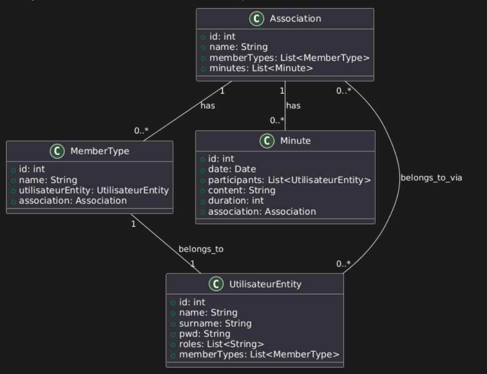

# Web Application: Application Management

## Development Team

| Name | Email | GitHub |
|------|-------|--------|
| Elisa Donet | e.donet.2024@alumnos.urjc.es | dntelisa |
| Matheo Renault | m.renault.2024@alumnos.urjc.es | Rath0me |


## Project Coordination
- **Trello Board**: [[Trello Link]](https://trello.com/invite/623787fba3139956f2e254f9/ATTIcc5e4f3d4670f971016a3c76493b78b9276AAE4D)

## Key Features
### Entities
The main entities of the application are:
- **Association**: Represents an organization, with members and meeting minutes.
- **User**: Represents a person registered in the system.
- **MemberType**: Defines the roles that users have in an association.
- **Minute**: Stores meeting details of an association.

Relationships:
- An **Association** has multiple **MemberType** roles.
- An **Association** has multiple **Minutes**.
- A **User** can belong to multiple **Associations** via **MemberType**.

### User Permissions
- **Admin**: Can create, update, and delete associations, members, and meeting minutes.
- **Member**: Can view and join associations, participate in meetings.
- **Guest**: Can view public association details but cannot modify content.

### Images
- **Users** can have a profile picture.
- **Associations** can have a logo or banner image.
(we don't have enough time to complete this part)

## Development Contributions

### Tasks Completed by Each Developer
#### Elisa DONET
- User identification
- How the navigation bar works
- HTML and CSS

#### Mathéo RENAULT
- Creation of entities
- Comments
- Diagramm

### 5 Most Important Commits
1. Create repository, service and style sheet
2. Add data on db and display on home page
3. List asso + members + search user by with nav bar
4. Role in DB
5. Add new association

### 5 Key Files
1. AssoController.java
2. SecurityConfiguration.java
3. Association.java
4. UtilisateurEntity.java
5. Index.html

## Screenshots & Navigation Flow

- **Home Page**: 
- **Association Details Page**: 
- **User Profile Page**: 
- **Meeting Minutes Page**: 
- **Admin Dashboard**:

### Navigation Diagram


## Execution Instructions
### Prerequisites
- **Java**: Version 21.0.5
- **MySQL**: Version 8.0.4
- **Maven**: Version 3.9.9

### Running the Application
1. Clone the repository:
   ```sh
   git clone (https://github.com/SSDD-2025/practica-sistemas-distribuidos-2025-grupo-1.git)
   ```
2. Navigate to the project directory:
3. Configure the database in `application.properties`:
   ```properties
   spring.datasource.url=jdbc:mysql://localhost:3306/associations
   spring.datasource.username=root
   spring.datasource.password=password
   ```
4. Install dependencies and build the project:
   ```sh
   mvn clean install
   ```
5. Run the application:
   ```sh
   mvn spring-boot:run
   ```

## UML & Class Diagrams
### Database Entity Diagram
//Img UML 

### Class Diagram


---


