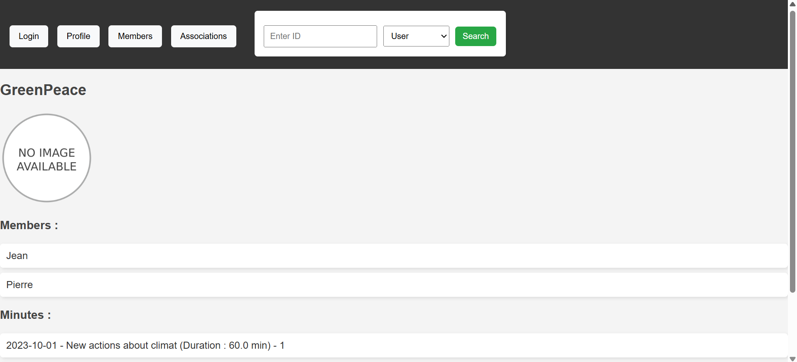
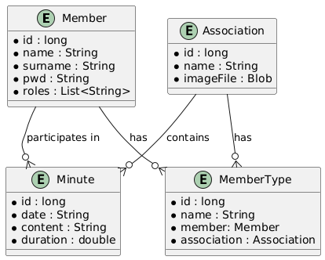

# Web Application: Association Management

## Development Team

| Name | Email | GitHub |
|------|-------|--------|
| Elisa Donet | e.donet.2024@alumnos.urjc.es | dntelisa |
| Matheo Renault | m.renault.2024@alumnos.urjc.es | Rath0me |


## Project Coordination
- **[Trello Board](https://trello.com/invite/623787fba3139956f2e254f9/ATTIcc5e4f3d4670f971016a3c76493b78b9276AAE4D)**
## Key Features
### Entities
The main entities of the application are:
- **Association**: Represents an organization, with members and meeting minutes.
- **Member**: Represents a person registered in the system, can be part of an association and attend to meetings
- **MemberType**: Defines the roles that users have in an association.
- **Minute**: Stores meeting details of an association.

Relationships:
- An **Association** has multiple **MemberType** roles.
- An **Association** has multiple **Minutes**.
- A **Member** can belong to multiple **Associations** via **MemberType**.
- A **Minute** is linked to an Association and has multiple **Member** participants.

### User Permissions
- **All users, guest**  
   -> View content of associations, minutes and members  
- **Member**  
   -> Edit and delete own profile  
   -> Join association  
   -> Create minutes if part of the association  
- **Admin**:  
   -> Create, update and delete associations  
   -> Delete members  
   -> Delete minutes  
   -> Update minutes if part of the association  

### Images
- **Associations** can have a logo or banner image.

## Development Contributions

### Elisa DONET
#### Tasks completed in the first part
In the first phase of the project, I focused on enhancing the application's user interface by creating and styling HTML pages, including error pages, to ensure a cohesive and user-friendly experience. I reorganized the project files for better structure and maintainability, and I added comprehensive comments throughout the code to improve readability and understanding. Additionally, I developed the entity diagram to visually represent the relationships within the system, adjusted the README file for clarity, and programmed the controllers, services and repositories, refining the entities to ensure they accurately reflected the project requirements.

#### 5 Most Important Commits
1. [Add data to the database and display on the home page](https://github.com/SSDD-2025/practica-sistemas-distribuidos-2025-grupo-1/commit/ddd91a58fc50fd7180d097ab55e0a493a4a3b843)
   - Added data to the database and displayed it on the home page, repairing issues with SQL links and renaming the user entity.

2. [Create minute in association with restriction on date](https://github.com/SSDD-2025/practica-sistemas-distribuidos-2025-grupo-1/commit/577dd52e28803cf5a7e52dfbe4d5559c904ec744)
   - Implemented the creation of minutes in an association with restrictions on the date, ensuring it cannot be superior to the current date.

3. [Delete account](https://github.com/SSDD-2025/practica-sistemas-distribuidos-2025-grupo-1/commit/8cbf43925aca444bf6d7f9d3f16517e5e05158dd)
   - Added functionality to delete user accounts.

4. [Organize code in good file](https://github.com/SSDD-2025/practica-sistemas-distribuidos-2025-grupo-1/commit/ac30e1a5e6b56af66a9f2e869246ac3546c878a0)
   - Organized the code into appropriate files for better structure.

5. [Add comments](https://github.com/SSDD-2025/practica-sistemas-distribuidos-2025-grupo-1/commit/fbe3da4d3f45f148e300fa48ff700c411875b1bf)
   - Added comments to the code for better understanding and documentation.

#### 5 Key Files
1. AssoController.java
2. SecurityConfiguration.java
3. Association.java
4. UtilisateurEntity.java
5. Index.html

#### Tasks completed in the second part
In the second phase, I implemented critical security features, including user authorization and authentication mechanisms. I established role-based permissions to control access to various pages, ensuring that users could only access content appropriate to their roles. I adjusted the login and logout functionalities for the Member entity to incorporate both user and admin roles, facilitating secure access to different parts of the application. I integrated CSRF protection to safeguard against cross-site request forgery attacks and employed BCrypt for password encryption, enhancing data security. Furthermore, I added HTTPS encryption to secure web communications, ensuring that all data transmitted between the client and server remained confidential and protected.

#### 5 Most Important Commits
1. [Encrypted communication via HTTPS and user with credentials in the code](https://github.com/SSDD-2025/practica-sistemas-distribuidos-2025-grupo-1/commit/4e966f14a3175233ed5473d121341965b7c036b3)
   - Implemented encrypted communication via HTTPS and managed user credentials in the code. The display of the navigation bar changes if users are logged in or not.

2. [Identification with role](https://github.com/SSDD-2025/practica-sistemas-distribuidos-2025-grupo-1/commit/186b149b90d420859926c068e544bd86a4bfffa0)
   - Added identification with roles for users.

3. [Roles in DB](https://github.com/SSDD-2025/practica-sistemas-distribuidos-2025-grupo-1/commit/80665252ee2dc7c65d592364f306a0090e366800)
   - Implemented roles in the database.
     
#### 5 Key Files
- SecurityConfiguration
- CSRFHandlerConfiguration

### Mathéo RENAULT
#### Tasks completed
- Creation of entities
- Navigation diagram
- Class diagram


## Screenshots & Navigation Flow

- **Home**: 
- **Association Details**: 
- **Association Details for admin members**: 
- **Association Details for members who are not members of the association and not administrators**: 
- **Members List**: 
- **Member Details**: 
- **Login**: 
- **Profile**: 
- **Create Account Page**: 
- **Create Minute**: 
- **Create Asso**: 


### Navigation Diagram


## Execution Instructions
### Prerequisites
- **Java**: Version 21.0.5
- **MySQL**: Version 8.0.4
- **Maven**: Version 3.9.9

### Running the Application
1. Clone the repository:
   ```sh
   git clone (https://github.com/SSDD-2025/practica-sistemas-distribuidos-2025-grupo-1.git)
   ```
2. Navigate to the project directory:
   ```cd practica-sistemas-distribuidos-2025-grupo-1```
4. Configure the database in `application.properties`:
   ```properties
   spring.datasource.url=jdbc:mysql://localhost:3306/associations
   spring.datasource.username=root
   spring.datasource.password=password
   ```
5. Install dependencies and build the project:
   ```sh
   mvn clean install
   ```
6. Create database associations in MySQL Workbench
7. Run the application:
   ```sh
   mvn spring-boot:run
   ```

## Diagrams
### Database Entity Diagram 
 

### Class Diagram

### Navigation Diagram

---


